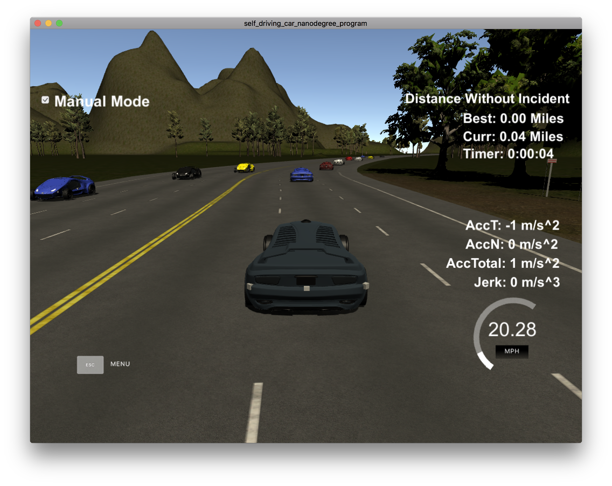
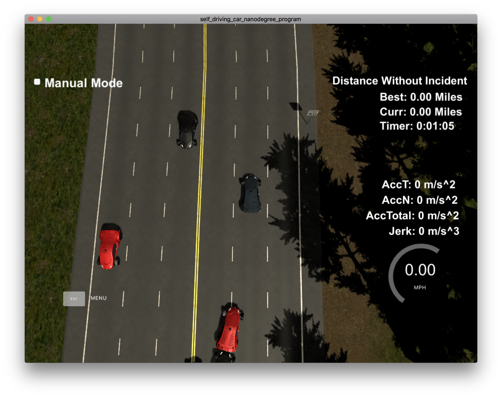

# Prolog Path Planning

## Video Demo

<video src="demo_video.mov"></video>


## Overview

Prolog based autonomous vehicle path planning expert system. 

The search functionality receives a root state and uses RRT search to find the best path to a goal. 

[Link to udacity project base](https://github.com/udacity/CarND-Path-Planning-Project)

[Link to udacity simulator](https://github.com/udacity/self-driving-car-sim/releases/tag/T3_v1.2)



## Heuristic Search

We've Implemeneted RRT search in prolog. It's similar to A search, with the main difference being randomized successor state generation. 

### Prolog Demo Run

```
?- go.
% 24,359,229 inferences, 1.995 CPU in 2.001 seconds (100% CPU, 12210581 Lips)
_42344{ax:9.57815564499316,ay:1.408692559030297,vx:5.986975616804219,vy:1.2929424668511251,x:8.394853080590037,y:0.558427948486169}+ +316.65645386340015
[6,6.449054588194492,8.394853080590037]
[0,0.11759616588669386,0.558427948486169]
true.
```


## Logic and Planning

In this project our goal is to safely navigate around a virtual highway with other traffic that is driving +-10 MPH of the 50 MPH speed limit. The car should try to go as close as possible to the 50 MPH speed limit, which means passing slower traffic when possible, note that other cars will try to change lanes too. The car should avoid hitting other cars at all cost as well as driving inside of the marked road lanes at all times, unless going from one lane to another.

* throttle control to stay near 50 MPH target speed. 
* frontal, lateral, rear collision avoidance. 
* lane switch pipeline



## World Model

* The world is a 6946m length highway loop.
* MapGateway coordinates are in meters.
* The simulator will visit all output coordinates every 0.02 seconds
* The number of output coordinates is up to us.
* The increment between coordinates determines the vehicle velocity, yaw, etc. 
* there are 3 lanes in each direction of the highway
* lanes are 4m wide
* vehicle starts at the center lane
* center of center lane is 6m from left edge of left lane in direction of travel.

## Sensor Fusion

The data format for each car is: [ id, x, y, vx, vy, s, d]. The id is a unique identifier for that car. The x, y values are in global map coordinates, and the vx, vy values are the velocity components, also in reference to the global map. Finally s and d are the Frenet coordinates for that car.

`0 1056.683 1159.969 14.97111 6.122647 274.0449 9.965927`

## Goals and Limits

* max speed of 50 mph (80.4672 km/h, 22.352 m/s)
* max acceleration of 10 m/s^2
* max jerk of 10 m/s^3

## Command and Control

Mostly handeled by simulator. C++ does various pre and post processing  steps.

